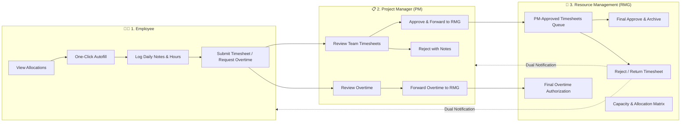

# ⚡ Pulse — Frictionless Timesheet & Resource Management

**Pulse** is a high-performance, frictionless timesheet and workforce resource management web application designed for modern enterprise engineering organizations. It bridges the gap between daily developer activity tracking, Project Manager (PM) approvals, and Resource Management Group (RMG) capacity planning.

Built with pure Vanilla JavaScript (ES6+), custom CSS custom properties (Design Tokens), and HTML5 Canvas visualizations without heavy external dependencies.

---

## 🌟 Key Personas & Core Workflows

Pulse provides specialized role-based views tailored to three primary stakeholders:



### 1. 🧑‍💻 Employee Hub (`EmployeeView`)
* **Ledger-Style Timesheet Grid**: Fast, high-density weekly ledger input with keyboard accessibility (`Tab`, `Enter` navigation, auto-focus).
* **One-Click Auto-Fill**: Automatically populates 40h/week (8h/workday) based on currently assigned project allocations.
* **Granular Task & Standup Notes**: Modal to log day-by-day task achievements, Jira tickets, and standup notes for each project row.
* **Overtime Request System**: Submit formal requests for additional hours beyond 8h/day with business justification and billing categorization.
* **Real-time Visual Analytics**: Integrated Canvas bar chart showing daily logged vs. expected workload with overtime indicators.
* **Nudges & Multi-Stage Alerts**: Actionable alerts for manager nudges, PM approvals, and rejection feedback from either PM or RMG.

### 2. 📋 Project Manager Hub (`PMView`)
* **Team Submission Dashboard**: Real-time audit status for all team members (*Draft, Submitted, PM Approved / Pending RMG, Final Approved, Rejected*).
* **2-Stage Approval Pipeline**: Approving a submitted timesheet automatically endorses and forwards it directly to the RMG review queue.
* **Constructive Rejection Workflow**: Return timesheets with specific reason codes (e.g., *Incorrect Work Item*, *Hours Discrepancy*, *Missing Notes*) and custom remarks.
* **Overtime Review & Escalation**: Review submitted overtime requests, add PM recommendations, and forward to RMG for final financial clearance.
* **Resource Requisitioning**: Submit formal requests to RMG for new headcount, specific skills (e.g. React, Kubernetes), and allocation duration.

### 3. 🎯 Resource Management Group Hub (`RMGView`)
* **PM-Approved Timesheets Queue**: Dedicated queue where RMG reviews all PM-endorsed timesheets. Final sign-off permanently certifies and archives the hours.
* **Dual-Notification Rejection Routing**: If RMG returns a timesheet, both the **Employee** and the **PM who approved it** instantly receive real-time notifications with RMG's revision remarks.
* **Workforce Capacity & Utilization Donut**: Live canvas donut chart breaking down organizational health into **Over-allocated (>100%)**, **Optimal (100%)**, **Partial (1–99%)**, and **Bench (0%)**.
* **Overtime Authorization Queue**: Centralized queue to authorize or deny financial overtime expenditure across all engineering projects.
* **Interactive Allocation Matrix**: Reassign and allocate engineers across 7 enterprise client projects with real-time over-allocation conflict prevention.

---

## 🏗️ Project Architecture & File Structure

Pulse is structured cleanly into decoupled modular subsystems:

```
tsIndex/
├── index.html               # Application entrypoint & font/CSS imports
├── README.md                # Project documentation & reference guide
├── css/
│   ├── design-tokens.css    # Color palettes, typography, elevations, spacing
│   ├── layout.css           # Global layout grid, header, nav, responsive wrappers
│   ├── timesheet-grid.css   # Ledger matrix styles, cell states, totals row
│   └── components.css       # Modals, toasts, buttons, status badges, banners
└── js/
    ├── app.js               # Global UI controller, role switching, toast & modal dispatch
    ├── state.js             # Reactive State Store with LocalStorage & event listeners
    ├── mock-data.js         # Initial mock database (Employees, PMs, Projects, Allocations)
    ├── charts.js            # Pure HTML5 Canvas charts (Daily Hours Bar & RMG Donut)
    ├── employee-view.js     # Employee timesheet ledger & note-taking components
    ├── pm-view.js           # PM approval dashboards & overtime forwarding
    └── rmg-view.js          # RMG capacity analytics, matrix & allocation managers
```

---

## 🎨 Design System & Visual Highlights

* **Typography**: Clean hierarchy with **Plus Jakarta Sans** for UI/headings and **JetBrains Mono** for numbers, ledger inputs, and metrics.
* **Design Tokens**: Centralized variables in [`css/design-tokens.css`](file:///c:/Users/Int202620/Desktop/tsIndex/css/design-tokens.css) providing theme tokens for background surfaces, borders, states (success, warning, error, info, nudge), and elevation layers.
* **Micro-Interactions**: Smooth CSS transitions on hover, modal scale animations, ledger input validation highlights, and floating toast notifications.
* **Visual Feedback**: Real-time totals calculation, overtime warning badges, and instant validation indicators.

---

## 🚀 Getting Started & Local Execution

Pulse requires **zero build steps** and **no node module installations**. It runs directly in any modern web browser.

### Option 1: VS Code / IDE Live Server
Right-click on [`index.html`](file:///c:/Users/Int202620/Desktop/tsIndex/index.html) and select **Open with Live Server**.

### Option 2: Node.js `npx serve`
```bash
npx serve .
```

### Option 3: Python Built-in Server
```bash
# Python 3
python -m http.server 8080
```
Then open `http://localhost:8080` in your browser.

---

## 👥 Personas Included in Mock Data

Switch between any persona in real-time using the top-bar persona selector:

| Persona | Role | Department / Scope |
| :--- | :--- | :--- |
| **Alex Chen** | Senior Frontend Engineer | Core Engineering (Allocated to *Fintech Gateway*, *HealthPulse*) |
| **Priya Sharma** | Full Stack Engineer | Engineering Platforms (Allocated to *OmniCommerce*) |
| **Marcus Vance** | Mobile & Cloud Specialist | Mobile Tech Group (*BankApp iOS/Android*, *Logistics Tracking*) |
| **Maya Patel** | Staff Product Designer | Product Design (*HealthPulse EHR*, *Design System 2.0*) |
| **Liam O'Connor** | DevOps & SRE Lead | Infrastructure (*Cloud Migration*, *Fintech Gateway*) |
| **Elena Rostova** | Head of RMG | Resource Management Group (Org-wide Governance) |
| **Sarah Jenkins** | Senior Project Manager | PM for *Fintech Gateway* & *Cloud Migration* |
| **David Kim** | Enterprise Project Manager | PM for *HealthPulse EHR* & *Logistics Realtime* |

---

## 💾 State Management & Persistence

The state is managed reactively through the `state` singleton in [`js/state.js`](file:///c:/Users/Int202620/Desktop/tsIndex/js/state.js):
* **Persistence**: Automatically syncs state changes to browser `localStorage` under the key `PULSE_TIMESHEET_STATE_v2`.
* **State Reset**: A built-in "Reset Demo Data" option in the UI allows instant reset back to the baseline mock dataset.
* **Pub/Sub System**: Components subscribe to state mutations to re-render UI views efficiently.

---

## 📄 License & Attribution

Developed as an enterprise-grade reference prototype for modern workforce timesheet and resource allocation management.
# pulse-timesheet

